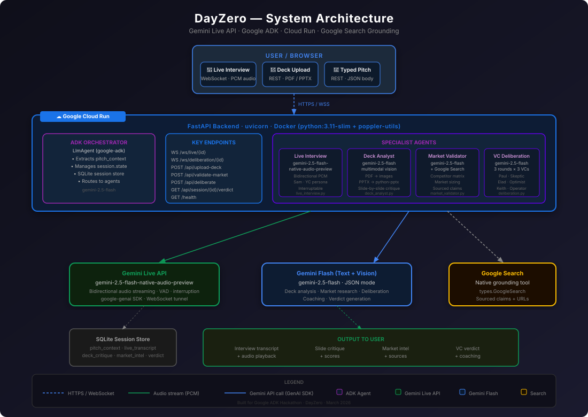

# DayZero

**AI-powered YC-style startup pitch validation**

DayZero simulates a Y Combinator interview panel to stress-test startup ideas. A founder goes through a live voice conversation, pitch deck critique, web-grounded market research, and a 3-round VC deliberation — all powered by Gemini and orchestrated by Google ADK.



---

## What It Does

| Phase | Description | Model |
|-------|-------------|-------|
| **Live Interview** | Real-time voice conversation with "Sam," a YC-style AI partner. Interruptable. | `gemini-2.5-flash-native-audio-preview` |
| **Deck Analysis** | Upload a PDF or PPTX. Get slide-by-slide critique, narrative arc score, missing slides. | `gemini-2.5-flash` (vision) |
| **Market Intelligence** | Google Search-grounded competitor research, market sizing, pivot suggestions. | `gemini-2.5-flash` + Search grounding |
| **VC Deliberation** | 3 personas (Paul/Skeptic, Elad/Optimist, Keith/Operator) debate across 3 rounds. | `gemini-2.5-flash` |
| **Verdict** | Scored investment decision (0–100), strengths, risks, coaching, next steps. | `gemini-2.5-flash` |

---

## Stack

| Layer | Technology |
|-------|-----------|
| **AI** | Google Gemini 2.5 Flash + Gemini Live API |
| **Agent Framework** | Google ADK (`google-adk`) |
| **GenAI SDK** | `google-genai` Python SDK |
| **Backend** | FastAPI + uvicorn + Python 3.11 |
| **Frontend** | React 19 + TypeScript + Vite + Tailwind CSS v4 |
| **Audio** | Browser `AudioWorklet` (PCM16) ↔ WebSocket ↔ Gemini Live (PCM24) |
| **Storage** | SQLite (persistent sessions) |
| **Deployment** | Docker → Google Cloud Run |

---

## Quick Start (Local)

### Prerequisites

- Python 3.11+
- Node.js 18+ (for frontend dev; not needed if using Docker)
- [Google AI Studio API key](https://aistudio.google.com/apikey) (free)
- `poppler-utils` for PDF deck analysis:
  ```bash
  # macOS
  brew install poppler
  # Ubuntu/Debian
  apt-get install poppler-utils
  ```

### 1. Clone and install

```bash
git clone <repo-url>
cd dayZero-2
python3.11 -m venv venv
source venv/bin/activate
pip install -r backend/requirements.txt
```

### 2. Configure

```bash
cp .env.example .env
```

Edit `.env` — the minimum required config:

```bash
LLM_PROVIDER=google
GOOGLE_API_KEY=your_ai_studio_key_here
ENABLE_LIVE_INTERVIEW=true
```

### 3. Run

```bash
# From project root
python -m uvicorn backend.main:app --host 0.0.0.0 --port 8080 --reload
```

Open **http://localhost:8080** — the React frontend is served by FastAPI.

### 4. (Optional) Run frontend in dev mode

```bash
cd frontend
npm install
npm run dev   # starts Vite on http://localhost:5173
```

---

## Docker (Recommended for Deployment)

### Build

```bash
docker build -t dayzero .
```

The image uses `python:3.11-slim` with `poppler-utils` and Liberation/DejaVu fonts. No LibreOffice — PPTX files are processed natively via `python-pptx` + Pillow. Image size: ~350MB.

### Run locally

```bash
docker run -p 8080:8080 \
  -e GOOGLE_API_KEY=your_key_here \
  -e LLM_PROVIDER=google \
  dayzero
```

---

## Deploy to Google Cloud Run

### Prerequisites

```bash
# Install gcloud CLI (macOS)
brew install google-cloud-sdk

# Authenticate and set project
gcloud auth login
gcloud config set project YOUR_PROJECT_ID

# Enable required APIs (one-time)
gcloud services enable run.googleapis.com artifactregistry.googleapis.com cloudbuild.googleapis.com
```

### 1. Create Artifact Registry repo

```bash
gcloud artifacts repositories create dayzero \
  --repository-format=docker \
  --location=us-central1
```

### 2. Build and push image

```bash
# Configure Docker auth
gcloud auth configure-docker us-central1-docker.pkg.dev

# Build and push
docker build -t us-central1-docker.pkg.dev/YOUR_PROJECT_ID/dayzero/app:latest .
docker push us-central1-docker.pkg.dev/YOUR_PROJECT_ID/dayzero/app:latest
```

### 3. Deploy

```bash
gcloud run deploy dayzero \
  --image us-central1-docker.pkg.dev/YOUR_PROJECT_ID/dayzero/app:latest \
  --region us-central1 \
  --memory 1Gi \
  --cpu 1 \
  --min-instances 0 \
  --max-instances 3 \
  --timeout 600 \
  --concurrency 10 \
  --session-affinity \
  --allow-unauthenticated \
  --set-env-vars "GOOGLE_API_KEY=your_key_here,LLM_PROVIDER=google,ENABLE_LIVE_INTERVIEW=true"
```

The deployed URL is printed on success. Open it in a browser — done.

**Cost**: Cloud Run free tier (2M requests, 360K vCPU-sec/month) covers normal hackathon/demo usage at $0.

---

## Project Structure

```
dayZero-2/
├── backend/
│   ├── main.py                    # FastAPI app, all HTTP + WebSocket routes
│   ├── config.py                  # Pydantic settings (env-driven)
│   ├── session_state.py           # ADK session management + SQLite persistence
│   ├── audio_utils.py             # PCM audio helpers
│   ├── providers/
│   │   ├── google_provider.py     # google-genai SDK wrapper
│   │   ├── mistral_provider.py    # Mistral API wrapper
│   │   └── openai_provider.py     # OpenAI API wrapper
│   ├── core/
│   │   ├── gemini_client.py       # Low-level Gemini API calls
│   │   └── slide_store.py         # Slide PNG disk cache
│   └── agents/
│       ├── orchestrator.py        # ADK LlmAgent root orchestrator
│       ├── live_interview.py      # Gemini Live API WebSocket bridge
│       ├── deck_analyst.py        # Multimodal deck analysis + native PPTX renderer
│       ├── market_validator.py    # Google Search-grounded market research
│       ├── deliberation.py        # 3-round VC panel debate
│       ├── audio_deliberation.py  # Audio version of deliberation
│       ├── coaching.py            # Post-verdict coaching
│       └── training.py            # Training data helpers
├── frontend/
│   ├── src/
│   │   ├── App.tsx
│   │   ├── pages/                 # Route-level page components
│   │   ├── components/            # Shared UI components
│   │   ├── services/              # API client layer
│   │   ├── hooks/                 # Custom React hooks
│   │   └── types/                 # TypeScript type definitions
│   ├── package.json
│   └── vite.config.ts
├── docs/
│   └── architecture.svg           # System architecture diagram
├── .env.example                   # All supported env variables with docs
├── Dockerfile
├── DEVPOST.md                     # Hackathon submission content
└── README.md
```

---

## Architecture

See [`docs/architecture.svg`](docs/architecture.svg) for the full visual diagram.

### How the agents connect

```
Browser (React + AudioWorklet)
  │
  ├─ WebSocket (PCM16 audio) ──► live_interview.py ──► Gemini Live API
  │                                                    (bidirectional PCM24)
  │
  ├─ POST /api/upload-deck ──► deck_analyst.py
  │     PDF → pdf2image (poppler)                  ──► gemini-2.5-flash (vision)
  │     PPTX → python-pptx + Pillow native render  ──►     (multimodal JSON)
  │
  ├─ POST /api/validate-market ──► market_validator.py
  │                                types.GoogleSearch  ──► gemini-2.5-flash
  │                                (native grounding)       + live web results
  │
  ├─ POST /api/deliberate ──► deliberation.py (3 rounds × 3 personas)
  │                           Each persona reads full debate history
  │                           from session.state before responding    ──► gemini-2.5-flash
  │
  └─ GET /api/session/{id}/verdict ──► synthesized from session.state
```

### ADK Role

`orchestrator.py` uses ADK's `LlmAgent` as the root agent. It owns `session.state` — a shared dict that all agents read from and write to. This is the memory backbone: `pitch_context`, `live_transcript`, `deck_critique`, `market_intel`, `debate_rounds`, and `final_verdict` all live here.

### Audio Pipeline Detail

```
Browser mic (getUserMedia)
  → MediaStreamSource
  → AudioWorklet (float32 → PCM16 @ 16kHz)
  → WebSocket binary frames
  → FastAPI /ws/live/{session_id}
  → live_interview.py relay loop
  → Gemini Live API WebSocket

Gemini Live API response
  → live_interview.py relay loop
  → WebSocket binary frames (PCM24 @ 24kHz)
  → Browser AudioContext (PCM → playback)
```

---

## Configuration Reference

All settings are environment variables. Copy `.env.example` to `.env` and edit.

| Variable | Default | Description |
|----------|---------|-------------|
| `LLM_PROVIDER` | `google` | `google` \| `mistral` \| `openai` |
| `GOOGLE_API_KEY` | — | Required. Get free key at [aistudio.google.com](https://aistudio.google.com/apikey) |
| `GEMINI_FLASH_MODEL` | `gemini-2.5-flash` | Text/vision model |
| `GEMINI_LIVE_MODEL` | `gemini-2.5-flash-native-audio-preview-12-2025` | Live audio model |
| `ENABLE_LIVE_INTERVIEW` | `true` | Set `false` for non-Google providers |
| `ENABLE_DECK_ANALYSIS` | `true` | Enable deck upload + analysis |
| `ENABLE_MARKET_VALIDATION` | `true` | Enable Google Search grounding |
| `SESSION_BACKEND` | `sqlite` | `sqlite` or `memory` |
| `DEBATE_ROUNDS` | `3` | Number of VC deliberation rounds |
| `DECK_RENDER_DPI` | `150` | DPI for slide rasterization |
| `LOG_LEVEL` | `INFO` | `DEBUG` \| `INFO` \| `WARNING` \| `ERROR` |

Full reference in [`.env.example`](.env.example).

---

## API Endpoints

| Method | Path | Description |
|--------|------|-------------|
| `POST` | `/api/session` | Create new pitch session |
| `GET` | `/api/session/{id}` | Get full session state |
| `POST` | `/api/pitch` | Submit typed pitch text |
| `POST` | `/api/upload-deck` | Upload PDF/PPTX pitch deck |
| `POST` | `/api/validate-market` | Trigger market research (background) |
| `POST` | `/api/deliberate` | Start VC deliberation (background) |
| `GET` | `/api/session/{id}/verdict` | Get investment verdict |
| `GET` | `/api/session/{id}/debate` | Get debate round transcripts |
| `GET` | `/api/session/{id}/slides/{n}` | Get rendered slide PNG |
| `WS` | `/ws/live/{id}` | Live audio interview WebSocket |
| `WS` | `/ws/deliberation/{id}` | Audio deliberation WebSocket |
| `GET` | `/health` | Health check |

---

## Troubleshooting

**`GOOGLE_API_KEY is not configured`**
Add `GOOGLE_API_KEY=your_key` to `.env` or pass as environment variable.

**PPTX upload: slides look plain / text only**
LibreOffice is not installed (expected in production Docker). The native `python-pptx` + Pillow renderer is being used — slides render with text overlays. For highest fidelity locally: `brew install libreoffice`.

**PDF upload fails: "Could not convert PDF"**
Poppler is not installed. `brew install poppler` (macOS) or `apt install poppler-utils` (Linux).

**Live audio not working**
- Browser must have mic permission granted
- Must run on `localhost` or `https://` (browsers block `getUserMedia` on plain HTTP)
- Check browser console for WebSocket errors

**Cloud Run: WebSocket disconnects after ~5 min**
The default Cloud Run request timeout is 300s. Use `--timeout 600` (or higher) in the deploy command. Already included in the deploy command above.

**`debconf` warnings during Docker build**
These are harmless — `apt-get` can't use interactive frontends inside Docker. The build succeeds regardless.

---

## Google Cloud Proof of Deployment

This project uses the following Google Cloud services and APIs:

| Service | Usage | Code Reference |
|---------|-------|----------------|
| **Cloud Run** | Hosts the entire FastAPI backend | `Dockerfile`, deploy command above |
| **Artifact Registry** | Stores the Docker image | `gcloud artifacts` commands above |
| **Gemini Live API** | Real-time bidirectional audio | `backend/agents/live_interview.py` |
| **Gemini Flash** | All text/vision analysis | `backend/core/gemini_client.py` |
| **Google Search Grounding** | Market validation | `backend/agents/market_validator.py` |
| **Google ADK** | Agent orchestration | `backend/agents/orchestrator.py` |
| **google-genai SDK** | All model calls | `backend/providers/google_provider.py` |

---

## Acknowledgments

- [Google ADK](https://google.github.io/adk-docs/) for multi-agent orchestration
- [Gemini Live API](https://ai.google.dev/gemini-api/docs/live) for real-time audio streaming
- [Google AI Studio](https://aistudio.google.com) for free-tier API access
- YC Partners for inspiration (Paul Graham, Elad Gil, Keith Rabois)

---

**Built for the Google Gemini Live Agent Challenge · March 2026**
